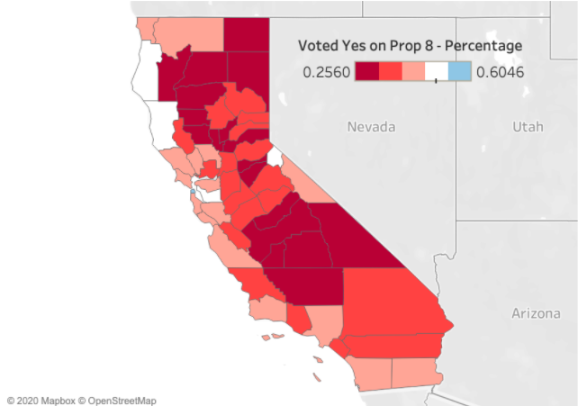
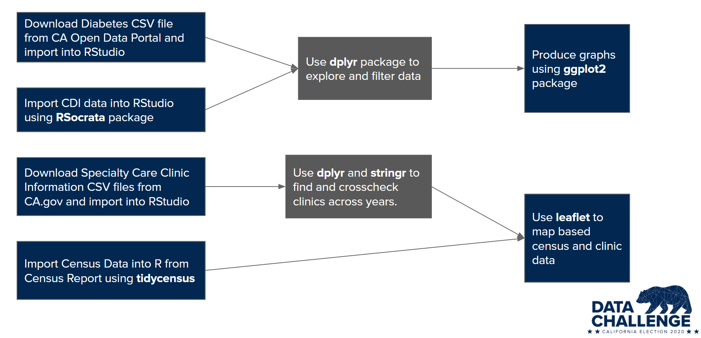

# Proposition 23 2020 CA Data Challenge

This is the main directory for data and support files for data visualizations related to [Proposition 23](https://voterguide.sos.ca.gov/propositions/23/) by Team Dialysis Analysis.

#### last updated: 10/4/2020
#### last update by: [Jessica Mizzi](https://github.com/jessicamizzi)

### Project Motivation
The purpose of this project is to provide data visualization about Proposition 23, which would invoke new rules for Dialysis Clinics. This GitHub repository contains code for team Dialysis Analysis for the [2020 CA Data Challenge](https://datalab.ucdavis.edu/ca-election-2020-data-challenge/) sponsored by [UC Davis DataLab](https://datalab.ucdavis.edu/) and the [Scholars Strategy Network](https://scholars.org/chapter/sacramento). Our goal is to provide data visualizations that will allow voters to make an informed decision about Proposition 23 during the 2020 California election.

## About Dialysis and Clinics

Dialysis is a medical procedure where a patient's blood is taken out of their body, cleaned, and put back for patients that are experiencing kidney failture. Patients must receive dialysis three times a week for 3-4 sessions until they receive a new kidney or for the rest of their lives. As of 2020, **roughly 80,000 individuals in CA depend on dialysis** to survive. Out of the **600 dialysis clinics** in California, **75%** are owned by the private, for-profit companies [DaVita, Inc.](https://www.davita.com/) and [Fresenius Medical Care](https://fmcna.com/).

## Tenents of Prop 23

**1. Require a Licensed Physician, Physician’s Assistant, or Nurse Practitioner to be on site at clinics during operating hours.**

Currently, dialysis clinics are staffed with Patient Care Technicians and a Medical Director. Prop 23 would require a Physician, Physician's Assistant, or Nurse Practitioner to be on site at all times that patients are being treated.

**2. Require clinics to report infections to the state.**

Dialysis clinics currently report infection data to the federal government. Proponents of Prop 23 say that this would make it easier for patients to find this information, and because this information is already collected, it would not be difficult to also report it to the state. Opponents of Prop 23 say that it is unnecessary to report this information because it is already given to the federal government.

**3. Require clinics to get approval before closing.**

Although hospitals are required to get approval before closing, dialysis clinics do not. Proponents of this bill say that this requirement will prevent For-Profit clinics from closing clinics that are in remote locations or not profitable, insuring that patients do not lose access to clinics.

**4. Prohibits clinics from discrimination against patients based on public or private insurance.**

Prop 23 would prevent dialysis clinics from treating patients different based on their insurance type.

## Supporters and Opponents of Prop 23

Graphic source: [CalMatters](https://calmatters.org/election-2020-guide/proposition-23-kidney-dialysis-clinics/)

## Prop 8 (2018) vs Prop 23 (2020) and Campaign Spending

Proposition 8 was a dialysis measure on the 2018 ballot. It required that dialysis companies pay back profits over 15% to insurance companies or individuals who pay out of pocket for dialysis services. This ballot measure was defeated, roughly 60% of people voted no compared to the 40% who voted yes. Below is a graph that shows the voting results by countries.

#### 2018 Prop 8 Voting Results

Data source: [General Election - Statement of Vote, November 6, 2018 from sos.ca.gov](https://www.sos.ca.gov/elections/prior-elections/statewide-election-results/general-election-november-6-2018/statement-vote)

Both Prop 8 and Prop 23 involve large amounts of campaign contributions. We believe it is important for voters to be aware of what kind of financing is associated with this ballot. Prop 23 is California's second most expensive ballot measure this year, second only the Prop 22. So far, **California is the top spender in contributions with $538 million total**. The next highest spending state if Illinois, which had $80.6 million, only 15% of that. We encourage voters to reflect on the ballot measure history and financing when they consider which way they want to vote.

#### Campaign Contributions for Prop 8 (2018) and Prop 23 (2020)

Data source: CalMatters Voter Guides [2018](https://elections.calmatters.org/2018/california-ballot-measures/proposition-8-dialysis-clinic-profit-pruning/) and [2020](https://calmatters.org/election-2020-guide/proposition-23-kidney-dialysis-clinics/)

## Project Workflow

## Directory Structure

* **[code](https://github.com/jessicamizzi/Prop23-CA-DataChallenge-2020/tree/main/code)**: contains R code analyses

	* [CA_Diabetes.R](https://github.com/jessicamizzi/Prop23-CA-DataChallenge-2020/blob/main/code/CA_Diabetes.R) - generates [Diabetes Prevalence by Income](https://github.com/jessicamizzi/Prop23-CA-DataChallenge-2020/blob/main/output/Income_Diabetes.png) and [Diabetes Prevalence in CA](https://github.com/jessicamizzi/Prop23-CA-DataChallenge-2020/blob/main/output/Diabetes_prevalence.png) graphs	
	* [CDI.R](https://github.com/jessicamizzi/Prop23-CA-DataChallenge-2020/blob/main/code/CDI.R) - generates [Chronic Kidney Disease Prevalence](https://github.com/jessicamizzi/Prop23-CA-DataChallenge-2020/blob/main/output/CKD_prevalence.png) and [End-Stage Renal Disease and Diabetes](https://github.com/jessicamizzi/Prop23-CA-DataChallenge-2020/blob/main/output/ESRD_diabetes.png) graphs
	* [Dialysis_Profit_vs_Nonprofit_comparison.R](https://github.com/jessicamizzi/Prop23-CA-DataChallenge-2020/blob/main/code/Dialysis_Profit_vs_Nonprofit_comparison.R) - generates **insert link to Haneya's graphs here**
	* [SIR_analysis.R](https://github.com/jessicamizzi/Prop23-CA-DataChallenge-2020/blob/main/code/SIR_analysis.R) - generates [SIR graph](https://github.com/jessicamizzi/Prop23-CA-DataChallenge-2020/blob/main/output/SIR_plot.png)	
	* [clinic_map.R](https://github.com/jessicamizzi/Prop23-CA-DataChallenge-2020/blob/main/code/clinic_map.R) - generates html map of clinic closing in CA [population_map.html](https://github.com/jessicamizzi/Prop23-CA-DataChallenge-2020/blob/main/output/population_map.html)

* **[data](https://github.com/jessicamizzi/Prop23-CA-DataChallenge-2020/tree/main/data)**: contains datasets small enough to host on GitHub
	* [Adults with Diabetes per 100](https://github.com/jessicamizzi/Prop23-CA-DataChallenge-2020/blob/main/data/adults-with-diabetes-per-100-lghc-indicator-23.csv)

* **[images](https://github.com/jessicamizzi/Prop23-CA-DataChallenge-2020/tree/main/images)**: images for the ReadMe

* **[output](https://github.com/jessicamizzi/Prop23-CA-DataChallenge-2020/tree/main/analysis_output)**: contains output from code. Each output is linked to the code that produced it in the code directory

## Contributors

**Kate Johnson** (Team Leader) | Dialysis Overview, Proposition Analysis | *UC Davis Statistics Undergrad* | kaejohnson@ucdavis.edu  
**Hyunsoo Gloria Kim**  | Prop 8 vs Prop 23 Analysis | *UC Davis Microbiology Graduate Group* | hyunsookim@ucdavis.edu  
**Haneya Mustafa** | Profit vs Non-Profit Clinic Quality of Care Analysis | *UC Davis & Family and Youth Institute* | hmustafa@ucdavis.edu  
**Earl Morales** | Chronic Kidney Disease and Diabetes Analysis | *UC Davis Statistics Alumnus* | epmorales@ucdavis.edu  
**Andrew Caffrey** | Dialysis Clinic Map Visualization | *UC Davis Food Science Graduate Group* | ajcaffrey@ucdavis.edu  
**Jessica Mizzi** | SIR Analysis, GitHub Construction | *UC Davis Microbiology Graduate Group* | jemizzi@ucdavis.edu  

## Data Sources

**2018 General Election Results and Proposition 8 Information**
* XLS and PDF downloaded from [sos.ca.gov](sos.ca.gov): [General Election - Statement of Vote, November 6, 2018](https://www.sos.ca.gov/elections/prior-elections/statewide-election-results/general-election-november-6-2018/statement-vote)
* Manually transferred dialysis clinic information from: [Ballotpedia - CA Proposition 8](https://ballotpedia.org/California_Proposition_8,_Limits_on_Dialysis_Clinics%27_Revenue_and_Required_Refunds_Initiative_(2018))
* CalMatters Voter Guides [2018](https://elections.calmatters.org/2018/california-ballot-measures/proposition-8-dialysis-clinic-profit-pruning/) and [2020](https://calmatters.org/election-2020-guide/proposition-23-kidney-dialysis-clinics/) 

**2020 Dialysis Facility Compare Dataset**
* Facility details and patient health parameters from Center for Medicare and Medicaid: [ESRD QIP National Healthcare Safety - Dialysis Facility Compare](https://data.medicare.gov/Dialysis-Facility-Compare/ESRD-QIP-National-Healthcare-Safety-Network-combin/bmqj-88i5)
* CSV file downloaded from [data.medicare.gov](data.medicare.gov)

**Mapping California Dialysis Clinics, Populations, and Income Levels**
* Dialysis clinic information extracted from the [ca.gov specialty care clinic datasets](https://data.ca.gov/dataset/specialty-care-clinic-complete-data-set) (2012-2019)
* Population and income data acquired through an API call to [Census Reporter](https://censusreporter.org/topics/) (2014-2019)

**Adults with Diabetes Per 100**
* Downloaded from [California Open Data Portal](https://data.ca.gov/dataset/adults-with-diabetes-per-100-lghc-indicator) as CSV file
* Source dataset for [Let's Get Healthy California](https://letsgethealthy.ca.gov/goals/living-well/decreasing-diabetes-prevalence/) Diabetes Indicator
* Based on CA Behavioral Risk Factor Surveillance System (BRFSS)

**US Chronic Disease Indicators**
* Extracted from [CDC Division of Population Health](https://chronicdata.cdc.gov/Chronic-Disease-Indicators/U-S-Chronic-Disease-Indicators-CDI-/g4ie-h725) using API call
	* Focus on CA BRFSS data
* Database containing data from all 50 states plus Washington D.C. & Puerto Rico

### Presentation Materials

* [GoogleSlides Project](https://docs.google.com/presentation/d/1dilmKT8ikLBBG8KGlc9RnVcHJqAQ8qxe_vIYHJnL1NE/edit?usp=sharing)
* Video Presentation: **insert link here**
